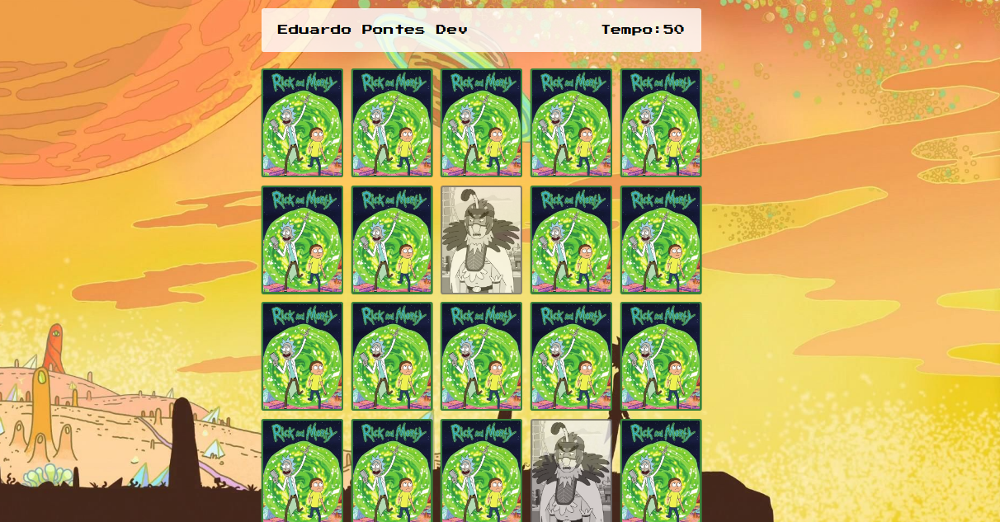

🧠 Jogo da Memória - Rick and Morty
Este é um jogo da memória simples feito com HTML, CSS e JavaScript puro, utilizando personagens do universo Rick and Morty. O objetivo é encontrar todos os pares de cartas iguais no menor tempo possível.

📸 Demonstração

🚀 Funcionalidades
Emparelhamento de cartas iguais

Contagem de tempo

Mensagem de parabéns ao fim do jogo

Armazena o nome do jogador via localStorage

Sistema de embaralhamento de cartas a cada jogo

🧩 Tecnologias utilizadas
HTML5

CSS3

JavaScript

🧱 Estrutura do Código
📂 HTML
Contém uma div.grid onde as cartas são renderizadas dinamicamente via JavaScript.

📁 JavaScript
characters[]: Array com os nomes dos personagens usados nas imagens.

loadGame(): Carrega e embaralha as cartas no grid.

createCard(character): Cria o elemento HTML de cada carta.

revelCard(): Lida com a lógica de virar as cartas.

checkCard(): Verifica se as duas cartas reveladas são iguais.

checkEndGame(): Detecta se o jogador venceu.

startTime(): Inicia o cronômetro.

window.onload: Recupera o nome do jogador, carrega o jogo e inicia o tempo.

🎮 Como jogar
Ao iniciar, seu nome será carregado do localStorage.

Clique nas cartas para revelar os personagens.

Encontre todos os pares idênticos.

Quando todos os pares forem encontrados, o jogo exibirá uma mensagem de parabéns.